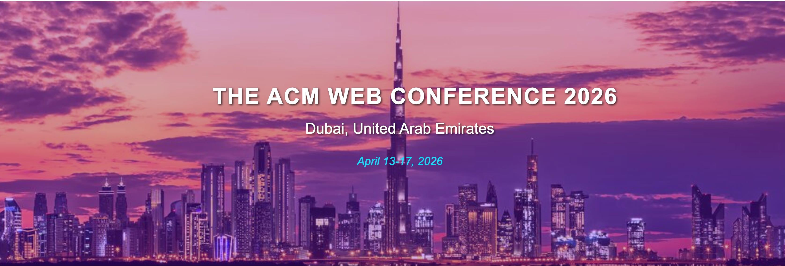
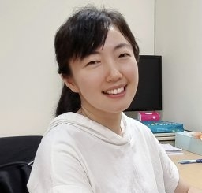
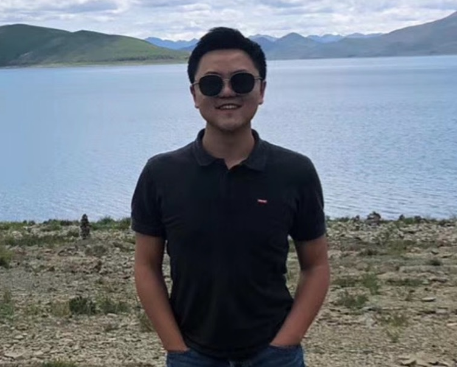
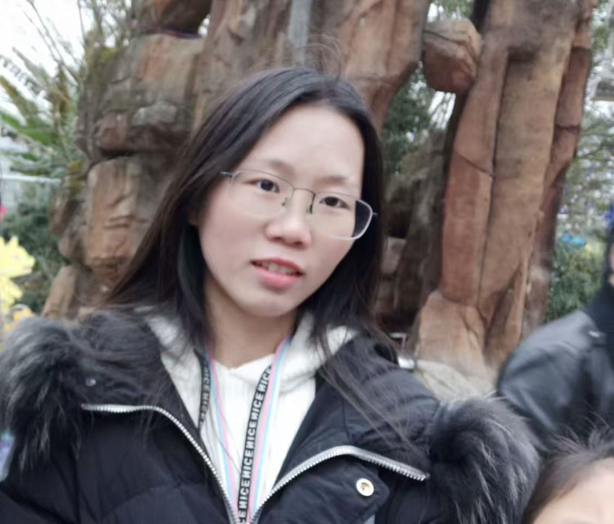
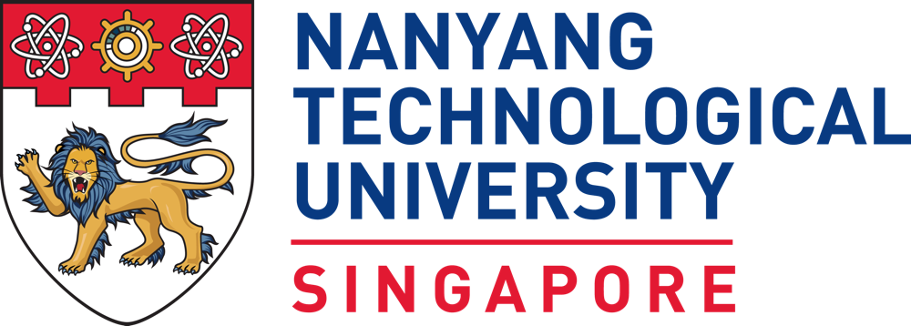
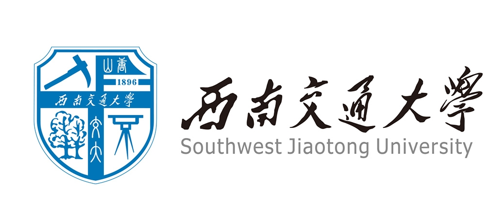

<!-- # International Workshop on Trustworthy Multimodal Learning for Social  Media Analysis（ACM Web Conference, 2026） -->

<!-- # International Workshop on Trustworthy Multimodal Learning for Social  Media Analysis  （ACM Web Conference, 2026） -->

<h1 style="text-align:center;">
  International Workshop on Trustworthy Multimodal Learning for Social Media Analysis
</h1>

<!-- ***

| [ABOUT](#about) | [CALL FOR PAPERS](#call-for-papers) | [IMPORTANT DATES](#important-dates) | [COMMITTEE](#committee) |
| --------------- | ----------------------------------- | ----------------------------------- | ----------------------- | -->

***

***

## ABOUT

With the rapid proliferation of social media platforms, the web has become a vast repository of diverse multimodal data, including text, images, audio, and video. This rich data offers unprecedented opportunities for comprehensive analysis but also introduces significant challenges in data fusion, information alignment, and robust processing. Large Multimodal Models (LMMs) have shown remarkable success in unimodal domains, yet their application to the complex and noisy nature of social media data necessitates significant innovation, particularly when such models are deployed on public-facing web platforms where performance, robustness, and safety are all critical. There is a growing need for trustworthy multimodal learning methods that can effectively integrate information from different modalities, maintain temporal, spatial, and semantic consistency, and reliably support downstream social media understanding tasks in real-world scenarios. 

The International Workshop on Trustworthy Multimodal Learning for Social Media Analysis (TML 2026) aims to bring together researchers, practitioners, and industry experts to discuss the latest advancements, challenges, and future directions in analyzing multimodal social media content using LMMs, as well as to rigorously evaluate their performance and safety for real-world deployment on web platforms. The workshop focuses on two critical and closely related frontiers: (1) multimodal social media content analysis with LMMs, including effective strategies for multimodal fusion and information alignment, and (2) performance and safety evaluation of LMMs, including the quality of generated content, instruction-following ability, model hallucinations, vulnerability to “jailbreak” attacks, and the generation of safe and appropriate content. By showcasing cutting-edge research and fostering discussion on these topics, TML 2026 seeks to shape future research directions in trustworthy multimodal learning for social media and to contribute to the development of more effective and safer multimodal AI systems for the web ecosystem. In addition to attracting high-quality research contributions, the workshop aims to build and mobilize an active community at the intersection of multimodal learning, social media analysis, and responsible AI.

***

## CALL FOR PAPERS

We welcome contributions of both technical and perspective papers from a wide range of topics, including but not limited to the following topics of interest:

**Trustworthy Multimodal Learning**

  * Multimodal Representation Learning for Short Videos

  * Model Robustness and Generalization

  * Content Authenticity Verification

  * Harmful Content Detection

**Evaluation Benchmarks and Metrics**

  * Designing comprehensive evaluation benchmarks for multimodal LLMs in social media scenarios

  * Constructing multimodal evaluation datasets covering text, images, videos, and audio
 
  * Balancing accuracy, robustness, and efficiency in multimodal model evaluation
 
  * Analyzing the applicability of existing benchmarks (MMBench, MME, etc.) in social media contexts

**Safety Evaluation Methods**

  * Evaluating adversarial attacks and defense strategies for multimodal LLMs

  * Hallucination detection and quantitative assessment in social media content generation
 
  * "Jailbreak" attack resistance testing for multimodal models
 
  * Safety evaluation standards for real-time content moderation scenarios

**Multimodal Feature Extraction for Short Videos**

  * Spatiotemporal multimodal features modeling challenges and solutions in short videos

  * Effectively capturing emotional cues and narrative structures in short videos

  * Correlation analysis between background music and visual content in short videos

  * Lightweight multimodal feature extraction for mobile short video processing
 
**Content Understanding and Analysis**

  * Topic classification and tag prediction for short video content

  * Multimodal sentiment analysis and opinion mining for short videos

  * Person recognition, action analysis, and scene understanding in short videos

  * Similarity detection and duplicate identification across platform short video content

**Content Quality Assessment**

  * Technical quality metrics: resolution, frame rate, audio clarity, compression artifacts

  * Aesthetic quality evaluation: visual composition, color harmony, editing quality

  * Content originality and creativity measurement frameworks
  
  * Multimodal content coherence assessment (audio-visual synchronization, narrative flow)

Submissions should be 4-8 pages long, excluding references, and must follow the new standard ACM conference proceedings template. The review process is single-blind, and assessed based on their novelty, technical quality, significance, clarity, and relevance regarding the workshop topics. An optional appendix of arbitrary length is allowed and should be put at the end of the paper (after references). All manuscripts should be submitted in a single PDF file including all content, figures, tables, references, and other information.  All accepted papers will be posted on the workshop website.

For LaTeX users: unzip acmart.zip, make, and use sample-sigconf.tex as a template; Additional information about formatting and style files is available online at: [https://www.acm.org/publications/proceedings-template](https://www.acm.org/publications/proceedings-template)

We will use EasyChair to manage the submission and peer-reviewing process for this workshop. Accepted papers will be presented as posters during the workshop and listed on the website. A small number of accepted papers will be selected to be presented as contributed talks (15-minute oral presentations). We also welcome submissions of unpublished papers, including those submitted/accepted to other venues if that other venue allows.

**Submission site: [https://easychair.org/my2/conference?conf=tml2026](https://easychair.org/my2/conference?conf=tml2026)**

***

## IMPORTANT DATES

| Event                          | Date              |
| ------------------------------ | ----------------- |
| **Submission Due**  | 06 January, 2026 (23:59:59 AoE) |
| **Notification Due** | 13 January, 2026 (23:59:59 AoE)    |
| **Camera Ready Due**    | 02 February, 2026 (23:59:59 AoE)      |
| **Workshop Date**    | 13-14 April, 2026      |

***

## SPEAKERS

  

    
    
<strong>Prof. Zhao Kang</strong> University of Electronic Science and Technology of China, China

  

  

    
    
<strong>Prof. Wenya Wang</strong> Nanyang Technological University, Singapore

  

  

    
    
<strong>Prof. Xu Yang</strong> Southeast University, China

  

## ORGANIZER
### Workshop Chairs

<!-- 第一排：3人 -->

  

    
    
<strong>Prof. Guosheng Lin</strong> Nanyang Technological University (NTU), Singapore

  

  

    
    
<strong>Prof. Fengmao Lv</strong> Southwest Jiaotong University, China

  

### Senior Program Committee

  

    
    
<strong>Junlin Fang</strong> Southwest Jiaotong University, China

  

  

    
    
<strong>Dr. Jianli Wang</strong> Southwest Jiaotong University, China

  

### Organized by

  
  

***

**Contact Information:**

For general inquiries about the workshop, please send an email to: [fengmaolv@126.com](fengmaolv@126.com), [fangjunlin001@gmail.com](fangjunlin001@gmail.com)

